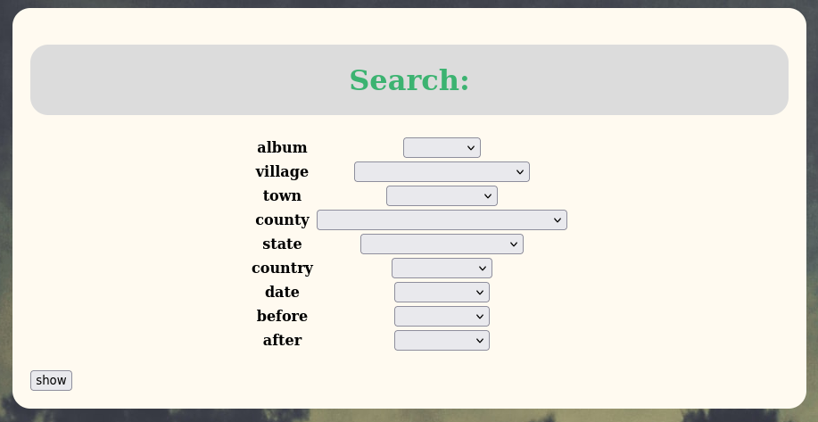
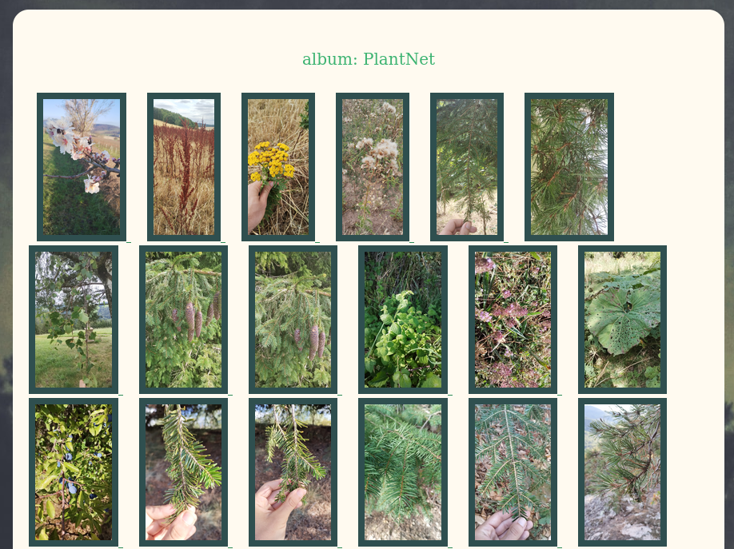

#  TODO URGENT: Protect the API with authentication/token.

Don't try to deploy this in an untrusted network for now, this is a work in progress.

# Rationale 

This web application is designed to serve jpeg photographies from a s3 bucket. I use S3-compatible storage on my home-server and couldn't find a software to display my pictures nicely in a web browser with the features I wanted:
- Using existing folder structure: the source bucket, folders and pictures should remain untouched.
- Help browsing the pictures based on metadata/albums and generate galleries on the fly.
- Not much else. For uploading picture I use s3 directly, so this is typically a feature I don't care about.

# How does it work?

This app uses Flask, python boto3 library to interact with s3, Flask-SQLAlchemy and a database (tested with postgres+psycopg) to store the metadata.
You need to configure the app before launching: see config.py.example.

It is recommended to create a specific access key for this app in s3: it requires only read access to your bucket.

In order to get the metadata, a function checks the images from your bucket, reads the metadata with pillow + geopy, and stores it in the database. This functions can be called from the web interface programmatically and is delayed to a celery worker, in order to integrate with S3 event-notification. It can be quite slow, but makes
a commit every 20 pictures, so you see your library growing.

 After this point, all metadata are stored in the sql-database. It is possible to create virtual "albums", that's to say arbitrary groups of pictures, based on these 
metadata. For example, with 
"http://localhost.localdomain:8000/gallery?town=Berlin&after=01.08.2023&before=15.08.2023"

You can even use SQL commands like this:

```
`"ALTER table 'pygallery' SET album = 'holliday_in_berlin' WHERE town = Berlin AND 01.08.2023 < date < 15.08.2023;
```
It doesn't change your pictures at all, just the way they are referenced.

The "gallery" view supports url queries with single or multiple parameters, retrieves a set of image in the database, generates pre-signed urls and create a gallery on the fly. (Thanks photoswipe!) If no query parameter is given, if displays a search interface which should be simple enough to use
for non-technical users.
Examples: 



It is also possible to view all metadata for an image and to edit them.

For now, login is deferred to s3 (on login, it tries to authenticate as the user and tries a ad command on the s3 bucket: it catches any authentication error and refuses the connection, else it sets a cookie accordingly, and after this point does not connect as the user.
API:
- The API works pretty much like gallery, but instead of a webgallery, it sends the metadata of an image set as a json object.
TODO: allow POST method for batch editing.

# Requirements (python):


boto3
botocore
Flask
Flask-SQLAlchemy
SQLAlchemy
pillow
geopy 

Note: 
SQLAlchemy offers a layer of abstraction on top of sql. Theoretically it should work with Mysql, Postres, etc. The last features were only tested with postgres+psycopg though.

# Requirements (javascript):

jquery.js and photoswipe are needed to display the galleries correctly.
The jinja template expect the modules to be installed in the static folder with npm.
